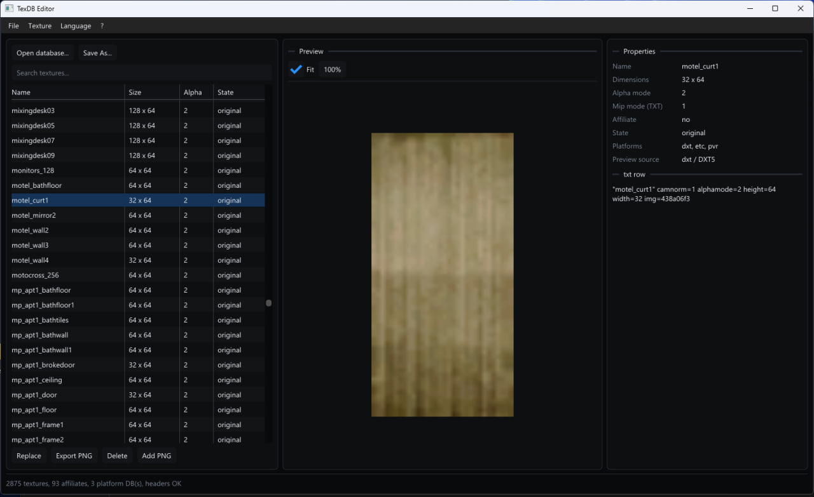

# MobileTexDBEditor
editor for renderware texture databases used by gta sa mobile / samp mobile clients.

made mostly for editing mobile `.txt/.dat/.toc` texture databases without converting whole pack through random android tools every time you need to replace one texture.

ui is fully rewritten to dear imgui + directx11. english is enabled by default, russian can be switched at any moment from language menu.

# demonstration



# what it works with

the editor expects gta sa mobile texture database in this format:

```text
name.txt
name.<platform>.dat
name.<platform>.toc
```

for example:

```text
gta_int.txt
gta_int.dxt.dat
gta_int.dxt.toc
```

if database has several platform pairs, editor finds all available `<name>.<platform>.dat/.toc` files and keeps them when rebuilding.

this is made for mobile renderware texture databases, not classic pc gta sa `.txd` files.

# supported formats

decoder currently understands:

```text
RGBA8888
RGBA4444
RGB565
DXT1
DXT5
```

pvrtc can be detected by format id, but decoding it is not implemented right now.

when texture was replaced or added, editor writes this texture back as `RGBA8888` with `mipmode=0`.

unchanged records are copied from original database byte-for-byte, so editor doesn't randomly recompress every texture in pack.

# editing

available operations:

```text
open database
replace selected texture
add new texture
export selected texture to png
delete selected texture
save rebuilt database to another folder
```

supported import images are handled through windows imaging component, currently normal use case is:

```text
.png
.jpg / .jpeg
.bmp
```

for samp mobile textures i recommend using png, especially if texture has alpha.

# save logic

editor intentionally doesn't overwrite source database through `Save As`.

when saving:

```text
1. creates new dat/toc files for every detected platform database
2. unchanged records are copied directly from source dat
3. replaced/new textures are written as rgba8888
4. deleted textures are skipped
5. toc offsets are rebuilt
6. txt is rebuilt while unknown lines/properties are preserved
7. new texture rows are appended
```

this is useful when you work with something like `gta_int.txt` or another big samp mobile texture pack and only changed several textures — rest of database doesn't get decoded and encoded for no reason.

# shortcuts

```text
Ctrl + O        open database
Ctrl + R        replace selected texture
Ctrl + I        add texture
Ctrl + E        export selected texture
Ctrl + Shift+S  save as
Delete          delete selected texture
```

you can also drag `.txt` database directly into editor window.

when database is already opened, dropping image file into window adds it as texture.

# building

requirements:

```text
windows 10/11
visual studio 2022 / msvc build tools
cmake 3.24+
directx 11
```

imgui sources are already inside `vendor/imgui`, you don't need to download dear imgui separately.

build:

```bat
cmake --preset vs2022-x64
cmake --build --preset debug
```

or just open project folder in visual studio as cmake project and build `MobileTexDBEditor` target.

project uses c++20.

# dependencies

```text
dear imgui
imgui win32 backend
imgui dx11 backend
direct3d11
dxgi
windows imaging component
```

no external image dlls are required.

# project structure

```text
├── CMakeLists.txt
├── CMakePresets.json
├── README.md
├── include/
│   ├── TextureDb.h        — mobile texdb parser / editor interface
│   └── ImageIO.h          — image loading and png export
├── src/
│   ├── main.cpp           — win32 window, dx11, imgui ui, localization, preview
│   ├── TextureDb.cpp      — txt/dat/toc parsing, texture decode and database rebuild
│   └── ImageIO.cpp        — wic image import/export
└── vendor/
    └── imgui/             — dear imgui + win32/dx11 backends
```

# how texdb is read

first editor opens `.txt` file and takes its basename.

then it searches same directory for matching platform databases:

```text
<basename>.<platform>.dat
<basename>.<platform>.toc
```

`.toc` contains dat size and offsets for texture records.

editor checks toc/dat size, reads texture record headers and uses data from txt to build texture list.

for preview it tries available platform databases until texture can be decoded.

record header contains encoding, width, height and payload information. if stored mip chain flag is present, decoder still takes first/full-resolution mip for preview.

# renderware / samp mobile notes

this tool was made around actual gta sa mobile / samp mobile texture databases, including stuff like loading screens, hud elements, speedometers and other client textures.

mobile texture packs are not same thing as normal pc renderware txd workflow. here database is split into txt metadata + dat payload + toc offsets, sometimes with several platform variants.

that's why replacing texture is not just "open txd and save image" — dat and toc need to stay synchronized with txt entries and record offsets.

editor handles this rebuild automatically.

# limitations

```text
classic pc .txd is not supported
pvrtc decode is not implemented
edited textures are always written as rgba8888
mip generation inside output texdb is not implemented for edited textures, mipmode is set to 0
save as requires another output folder and will not overwrite original database
```

writing everything as rgba8888 is intentional for now. it gives predictable result for custom samp mobile ui / loading textures and doesn't introduce extra dxt compression artifacts, but database can become bigger if you replace many compressed textures.
